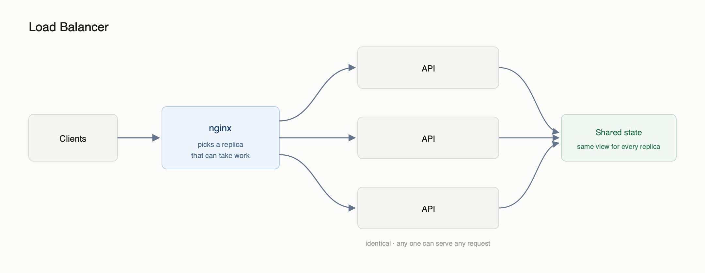

# Agentic-RAG

A multi-tenant RAG agent — upload PDFs, ask questions, get answers grounded in your
own documents. Retrieval is RAPTOR-based, so broad questions hit summary nodes and
specific ones hit leaf chunks.

## Flow diagrams

### Load balancer



## Getting started

```bash
cp .env.example .env        # fill in Azure + S3 keys
docker compose up -d
```

Then scale as needed:

```bash
docker compose up -d --scale api=3 --scale worker=4
```

API is on `http://localhost:3000`.
